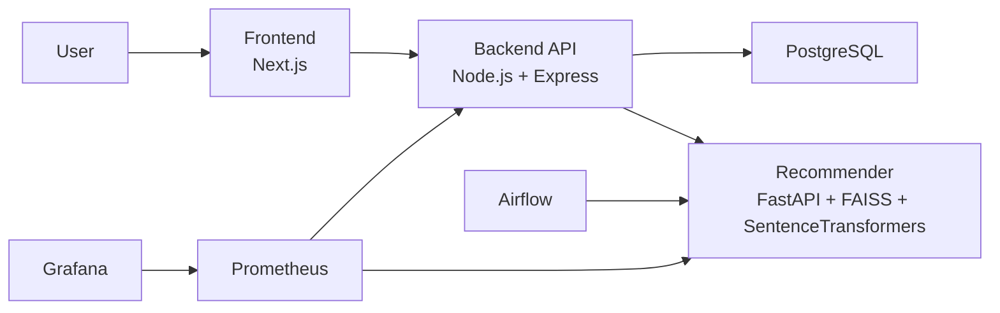

# MovieMix Design Document

## 1. Overview

MovieMix is a full-stack movie and series recommendation platform built as a
multi-service monorepo. The system combines a modern web frontend, a backend
API, a Python-based recommendation engine, a PostgreSQL database, scheduled
data jobs, and optional monitoring and Kubernetes deployment assets.

The main purpose of MovieMix is to help users discover movies efficiently using
multiple recommendation strategies instead of relying only on basic text
search. The platform supports semantic search, "more like this" content-based
recommendations, global trending recommendations, and personalized feeds based
on user interactions.

## 2. Problem Statement

Movie discovery platforms often suffer from one or more of these issues:

- Search is limited to exact title matching.
- Recommendations are generic and not personalized.
- Users do not understand why a title is recommended.
- Product teams cannot measure whether recommendation changes improve results.

MovieMix addresses these issues by:

- combining semantic retrieval with popularity and interaction signals,
- logging user behavior for personalization,
- attaching reason codes to recommendations, and
- supporting A/B analytics and offline evaluation.

## 3. Goals

- Provide fast and relevant movie discovery.
- Support multiple recommendation modes through a unified API.
- Personalize recommendations using user wishlist, watch, and rating signals.
- Surface explainable recommendation reasons in the UI.
- Enable experimentation and analytics for recommendation quality.
- Make the system deployable through containers and optional Kubernetes.

## 4. Non-Goals

- Real-time model training on every user action.
- Fully automated online learning.
- Streaming ingestion at large production scale.
- Multi-region or highly available production deployment.

## 5. Users and Use Cases

Primary users:

- End users looking for movies and shows.
- Developers or evaluators testing recommendation quality.
- Project reviewers assessing architecture, ML, and deployment design.

Core use cases:

- Search for a movie using natural language.
- Open a title page and get similar recommendations.
- Build a wishlist and receive personalized suggestions.
- Mark titles as watched and rate them.
- Review experiment metrics between recommendation variants.
- Refresh recommendation artifacts through scheduled jobs.

## 6. Functional Requirements

- User signup and login with JWT-based authentication.
- Browse starter titles and trending recommendations.
- Semantic search over movie plots and metadata.
- Content-based recommendations for a selected title.
- Personalized "For You" recommendations.
- Wishlist add/remove and wishlist retrieval.
- Interaction logging for views, detail opens, wishlist events, watched events,
  and ratings.
- Title detail page with reviews and optional watch links.
- Recommendation explainability using reason and reason_code fields.
- A/B experiment dashboard with CTR and conversion metrics.
- Nightly embedding rebuild support.

## 7. Non-Functional Requirements

- Fast recommendation lookup using FAISS vector search.
- Modular service boundaries between UI, API, and recommender.
- Clear observability through metrics endpoints.
- Easy local setup with Docker Compose.
- Reproducible recommendation evaluation with offline metrics.
- Secure configuration using environment variables for secrets.

## 8. High-Level Architecture

```text
Frontend (Next.js)
  -> Backend API (Express)
      -> PostgreSQL
      -> Recommender Service (FastAPI)
  -> Optional direct browser rewrites through Next.js API routing

Airflow
  -> Triggers embedding rebuild jobs in Recommender

Prometheus / Grafana / Alertmanager
  -> Scrape backend and recommender metrics
```

### Architecture Diagram



## 9. Component Design

### 9.1 Frontend

The frontend is implemented using Next.js and React. It provides:

- Home page for starter titles, trending content, and semantic search.
- "For You" page for personalized recommendations.
- Title detail page with similar titles, reviews, and watch links.
- Wishlist page.
- Login and signup pages.
- Experiment dashboard page.

Frontend responsibilities:

- capture user actions,
- call backend APIs,
- show recommendation reasons,
- maintain authentication token in local storage, and
- assign or display A/B variant behavior in the UI.

### 9.2 Backend API

The backend is built with Express and acts as the system's orchestration layer.
Its responsibilities include:

- authentication and JWT verification,
- wishlist management,
- title and review APIs,
- recommendation route orchestration,
- event and interaction logging,
- explainability enrichment,
- A/B analytics aggregation, and
- Prometheus metrics exposure.

The backend also enriches recommender output with metadata stored in
PostgreSQL, deduplicates items, and applies fallback strategies when one
recommendation path does not return enough useful results.

### 9.3 Recommender Service

The recommender is implemented in FastAPI and contains the machine-learning and
retrieval logic.

Responsibilities:

- build embeddings from catalog data,
- load and persist FAISS index artifacts,
- serve semantic recommendations,
- serve content-based recommendations,
- optionally rerank candidates with XGBoost,
- expose health and metrics endpoints.

The service stores embedding artifacts under its data directory, allowing
restart-safe reuse without rebuilding on every startup.

### 9.4 Database

PostgreSQL stores application and recommendation-supporting data:

- `titles`
- `users`
- `wishlists`
- `interactions`
- `interaction_events`
- `reviews`

The database serves as both the source of catalog metadata and the source of
interaction signals used for personalization and analytics.

### 9.5 Airflow

Airflow is used for scheduled operational workflows. A nightly DAG calls the
recommender's embedding rebuild endpoint so that vector artifacts can be
refreshed regularly as the catalog changes.

### 9.6 Monitoring

Prometheus scrapes both backend and recommender metrics. Alertmanager and
Grafana are included as optional monitoring components for visibility into API
traffic and service health.

## 10. Recommendation System Design

MovieMix uses a hybrid recommendation strategy.

### 10.1 Semantic Search

- User sends a natural-language query.
- Recommender converts the query into an embedding using
  `sentence-transformers/all-MiniLM-L6-v2`.
- FAISS searches the normalized embedding index.
- Top candidates are returned with similarity scores.
- Backend enriches candidates with title metadata and recommendation reasons.

This supports queries beyond exact title matching, such as theme- or plot-based
search.

### 10.2 Content-Based Recommendation

- User opens a title.
- The title name or seed text is sent to the recommender.
- Semantic retrieval returns similar items.
- Backend removes self-matches and enriches the results.

This powers the "more like this" experience from a title page.

### 10.3 Global Trending Recommendations

- Backend queries the `popular_titles` view or derived popularity data.
- Results are returned as top picks or trending content.
- If popularity-based results are weak, backend falls back to semantic
  retrieval from popular seeds.

### 10.4 Personalized Recommendations

- User actions are logged as events and converted into weighted interaction
  signals.
- Wishlist titles are used as strong personalization seeds.
- Personalized feed excludes items already present in the wishlist.
- If user-specific signals are weak, backend falls back to semantic and catalog
  popularity strategies.

### 10.5 Explainability

Each recommendation can include:

- `reason`
- `reason_code`

Examples:

- title match,
- semantic related,
- similar to selected title,
- trending across users,
- personalized popular.

This improves transparency and lets the frontend clearly explain why an item is
shown.

## 11. Data Flow

### 11.1 Semantic Search Flow

```text
User enters query
-> Frontend calls /api/recs/semantic
-> Backend forwards to recommender /recs/semantic
-> Recommender returns top vector matches
-> Backend enriches with DB metadata and reasons
-> Frontend renders cards
```

### 11.2 Personalized Feed Flow

```text
User logs in
-> Frontend calls /api/recs/cf_user
-> Backend loads wishlist and interaction context
-> Backend merges popularity and semantic fallback paths
-> Backend removes duplicates and wishlist items
-> Frontend renders personalized feed
```

### 11.3 Interaction Loop

```text
User views / rates / wishlists a title
-> Frontend posts event to /api/interactions
-> Backend stores raw event in interaction_events
-> Backend updates interactions with weighted signals
-> Later recommendation calls use those signals
```

## 12. Data Model

### 12.1 Core Tables

- `titles`: catalog metadata such as title, year, plot, genres, poster, and
  popularity.
- `users`: registered users and password hashes.
- `wishlists`: titles saved by a user, including source information.
- `interactions`: weighted user-title signals used for personalization.
- `interaction_events`: raw event log for analytics and rebuilding signals.
- `reviews`: user-submitted reviews and 1-5 ratings.

### 12.2 Design Notes

- `interaction_events` keeps the original audit trail.
- `interactions` stores the compact signal state needed for recommendation use.
- `wishlists` and `interactions` are linked to users and titles with foreign
  keys.
- `reviews` enforce one review per user-title pair.

## 13. API Design Summary

Representative endpoints:

- `POST /api/auth/signup`
- `POST /api/auth/login`
- `GET /api/titles`
- `GET /api/title/:id`
- `GET /api/recs/semantic`
- `GET /api/recs/content`
- `GET /api/recs/cf`
- `GET /api/recs/cf_user`
- `GET /api/wishlist`
- `POST /api/wishlist/:titleId`
- `DELETE /api/wishlist/:titleId`
- `POST /api/interactions`
- `GET /api/events/ab_summary`
- `POST /admin/build_embeddings`

Design characteristics:

- frontend-facing APIs stay simple,
- backend hides recommender-service complexity,
- auth-protected routes are isolated where needed,
- recommendation APIs return enriched and explainable data structures.

## 14. Scheduling and Data Refresh

The system supports scheduled artifact refresh using Airflow.

Nightly process:

- Airflow calls `/admin/build_embeddings`.
- Recommender pulls titles from PostgreSQL.
- New embeddings are generated.
- FAISS index and metadata artifacts are persisted to disk.

This keeps semantic recommendations aligned with the latest catalog state.

## 15. Evaluation and Experimentation

### 15.1 Offline Evaluation

MovieMix includes evaluation scripts for metrics such as:

- Precision@K
- Recall@K
- NDCG@K
- Genre-match@K
- Novelty@K
- Coverage@K

These metrics help validate whether recommendations are relevant, diverse, and
not overly repetitive.

### 15.2 Online Experimentation

MovieMix supports A/B testing by assigning users to variants and tracking:

- impressions,
- wishlist additions,
- watch events,
- ratings,
- CTR and conversions.

This enables comparison between recommendation strategies in a product-facing
way, not only through offline metrics.

## 16. Security and Configuration

Security-sensitive configuration is handled through environment variables, such
as:

- `DATABASE_URL`
- `JWT_SECRET`
- `AUTH_TOKEN`
- third-party API credentials

Security design choices:

- JWT authentication for protected endpoints.
- Secrets kept out of source code.
- Feature flags for optional integrations.
- Input validation and guarded access on authenticated routes.

## 17. Deployment Design

### 17.1 Docker Compose

Docker Compose provides local orchestration for:

- PostgreSQL
- backend API
- recommender
- frontend
- Airflow
- optional Prometheus, Grafana, and Alertmanager

This setup supports local development, demo environments, and reproducible
project review.

### 17.2 Kubernetes

The repository includes Kubernetes manifests for optional deployment of core
services. This gives the project a migration path from local containers to a
cluster-based environment.

## 18. Observability

Observability is included at two levels:

- backend metrics using `prom-client`,
- recommender metrics using FastAPI Prometheus instrumentation.

Monitored signals can include:

- request counts,
- response times,
- service availability,
- basic traffic trends.

This allows better debugging and performance tracking during demos or testing.

## 19. Risks and Limitations

- Personalization quality depends on sufficient user interaction data.
- Embedding rebuild is batch-based, not real-time.
- XGBoost reranking currently depends on model availability and feature quality.
- Recommendation quality is constrained by catalog completeness and metadata
  quality.
- A/B experimentation is useful for small-scale testing but is not yet a full
  enterprise experimentation platform.

## 20. Future Improvements

- Add richer collaborative filtering using user-user or item-item similarity.
- Improve reranker features using genre overlap, popularity priors, and user
  preference signals.
- Add caching for repeated recommendation queries.
- Add stronger authorization and session management controls.
- Introduce asynchronous event pipelines for higher-scale ingestion.
- Expand review moderation and user profile features.
- Add automated dashboards for recommendation-quality monitoring.

## 21. Conclusion

MovieMix is designed as more than a simple CRUD movie app. It is a layered
software system that combines product UI, API orchestration, hybrid
recommendation logic, data pipelines, monitoring, and deployable
infrastructure.

The design emphasizes modularity, explainability, extensibility, and practical
engineering tradeoffs. It is well suited as a showcase project for full-stack
development, recommender systems, applied machine learning, and DevOps-minded
software design.
